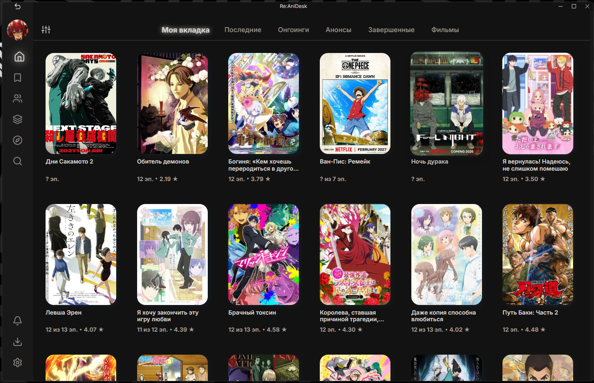

# AniDesk (Custom Build)

[-success?logo=virustotal)](https://www.virustotal.com/gui/file/d32574d85a82f2a39fc9a88ca194cd05381f3fabc5d8f335e7669a72ea2c499c/detection)



Неофициальный и улучшенный десктопный клиент для просмотра аниме, основанный на AniDesk который использует Anixart API. 

Эта версия содержит эксклюзивные визуальные улучшения, современные контурные иконки, исправленную геометрию интерфейса, а также **встроенный обход блокировок провайдера** (через быстрый CDN-прокси), благодаря которому обложки и картинки загружаются мгновенно и без ошибок.

---

## ✨ Что изменено / добавлено (Полный список возможностей)?

### 📺 Улучшения Плеера и Шейдеров (Новое в v2.0 / v2.1.0)
- **Масштабирование Anime4K:** Интегрированы высококачественные шейдеры Anime4K для сглаживания и апскейла. Проведена оптимизация производительности под встроенную графику AMD Vega (ThinkPad T14), устранившая просадки FPS.
- **Редактор пресетов:** Добавлен конструктор кастомных пресетов Anime4K с сохранением состояния переключателей.
- **Мгновенный переход:** Убран лаг (1-3 секунды) при переходе к следующей серии благодаря переводу оффлайн-проверок на синхронный кэш.
- **Гибкие настройки видео:** Добавлен выбор скорости воспроизведения `1.25x` и опция «Оригинальное» соотношение сторон (динамический расчет нативного разрешения видео для защиты от растягивания).
- **Сохранение предпочтений:** Плеер автоматически сохраняет и восстанавливает выбранную озвучку, источник и режим работы шейдеров.
- **Повышенная отзывчивость:** Хоткеи (включая Escape), громкость и Discord RPC инициализируются мгновенно, не дожидаясь ответов от сети.

### 📥 Оффлайн-загрузчик
- **Скачивание серий:** Полноценный менеджер загрузок (поддержка HLS/m3u8 и прямых MP4).
- **Своя библиотека:** Отдельный раздел "Оффлайн" для управления скачанными тайтлами.
- **Локальный плеер:** Воспроизведение без интернета напрямую с диска через собственный протокол `anidesk-offline://`.

### ⚡ Производительность и Стабильность
- **Умное кэширование:** Искоренены конфликты Windows при записи (исправлена ошибка EBUSY). Добавлен асинхронный запуск — никаких зависаний при открытии приложения.
- **Мгновенные картинки (Stream Lock fix):** Параллельная загрузка одних и тех же постеров больше не ломает приложение, все картинки грузятся плавно.
- **Безупречный плеер:** Устранены утечки памяти при переходе между сериями (чистое уничтожение `hls.js`), исправлено "прилипание" ползунка перемотки к курсору.
- **Мгновенный старт:** Убраны искусственные скрытые задержки в 1.5 секунды перед запуском видео с Libria/Sibnet.
- **Отказоустойчивость сети:** Если серверы Anixart падают или не отвечают, приложение больше не крашится белым экраном, а перехватывает ошибки и уведомляет пользователя.

### 🎨 Интерфейс и Визуал (UI/UX)
- **Обход блокировок:** Все постеры и изображения (`anixmirai`) загружаются через глобальный CDN Google/weserv (с авто-сжатием в WebP). Картинки больше не "отваливаются" у пользователей из СНГ.
- **Плавные анимации:** Добавлены CSS-анимации выезжающих панелей и кнопок бокового меню.
- **Премиум-карточки:** Восстановлены классические hover-эффекты и press-анимации с заливкой углов. Добавлено аппаратное GPU-ускорение — карточки тайтлов больше не "мылятся" при наведении курсора.
- **Современные иконки:** Старые замыленные пиксельные иконки заменены на строгие векторные SVG (Lucide Icons 24x24).
- **Идеальная сетка:** Выровнены отступы и симметрия сетки тайтлов на главной странице.

### ⚙️ Дополнительные фичи
- **Запоминание позиции просмотра:** Серия теперь продолжается ровно с того места, где вы остановились (функция полноценно выведена из беты и работает идеально).

---

## 📥 Как скачать и установить?

Скачать готовую к использованию программу можно прямо из этого репозитория:

1. Перейдите в раздел **[Releases (Релизы)](https://github.com/Ar3sSs-dev/AniDesk-App/releases)** справа.
2. Найдите последнюю опубликованную версию.
3. Скачайте архив с программой (или файл-установщик) из раздела `Assets`.
4. Распакуйте в удобное место и запустите `AniDesk.exe`!

---

## 💻 Быстрая установка (Для продвинутых пользователей)

Если вы не хотите скачивать установщик вручную, вы можете установить программу одной командой через **Windows PowerShell**. 

Эта команда автоматически скачает последнюю версию установщика во временную папку и запустит его. Для этого откройте PowerShell (Пуск -> PowerShell) и скопируйте туда следующий код:

```powershell
Invoke-WebRequest -Uri "https://github.com/Ar3sSs-dev/AniDesk-App/releases/download/v2.1.0/anidesk-2.1.0-win32.exe" -OutFile "$env:TEMP\anidesk_setup.exe"; Start-Process "$env:TEMP\anidesk_setup.exe"
```
